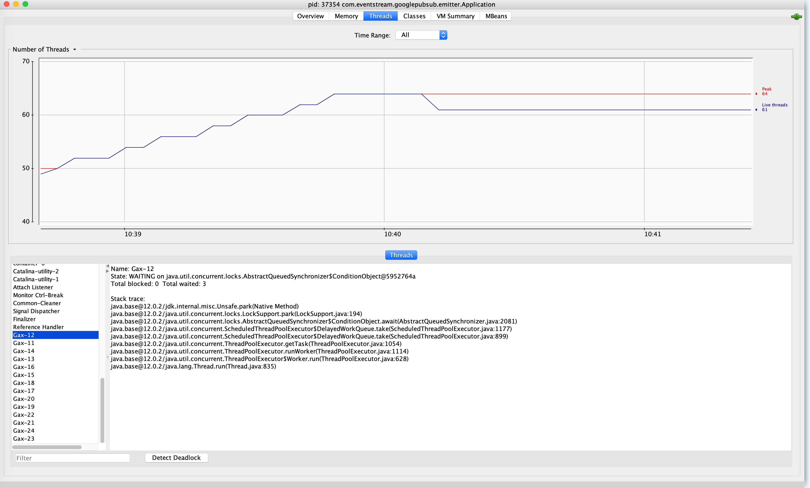
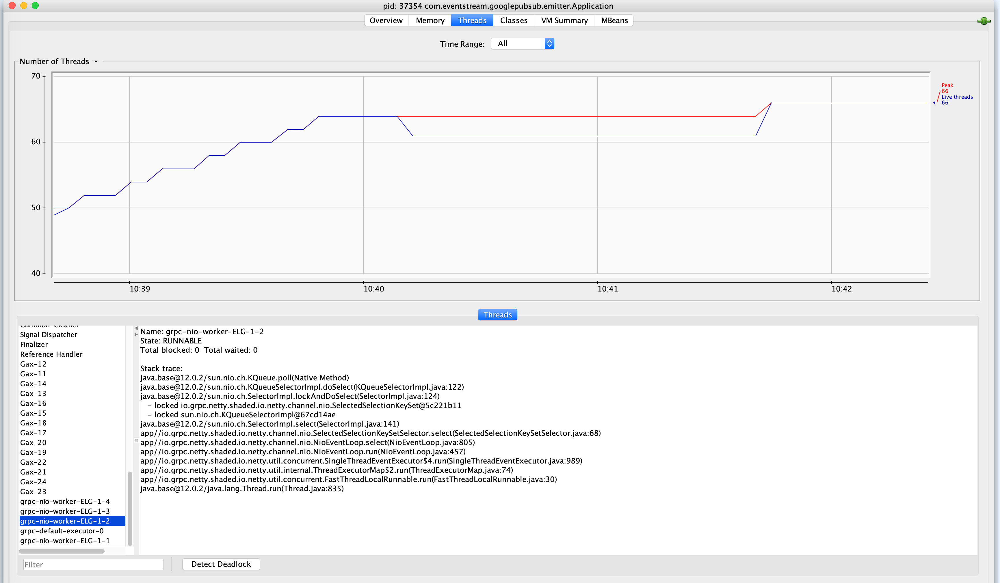

eventstream-skipper (googlepubsub)
-------------------

eventstream-googlepubsub
-----------------------

```
              |----------------------------------
publisher ~>  | 1 | 2 | 3 | 4 | 5 | ........| n |    ~>  subscription ~> Subscriber 
              |----------------------------------     
                        stream (topic)
```

Publisher
---------

- create stream (`topic`)
- create IAM role with write access and use it in publisher
- publisher - https://github.com/duwamish-os/eventstream-skipper-ii.java/blob/master/src/main/java/com/eventstream/googlepubsub/emitter/GooglePubsubEmitter.java

Subscriber
-----------

- create subscription
- use `subscriptionId` in consumer
- subscriber - https://github.com/duwamish-os/eventstream-skipper-ii.java/blob/master/src/main/java/com/eventstream/googlepubsub/consumer/GooglePubsubConsumer.java

HTTP Write Perf
----------

```bash
## google sdk
curl --request POST localhost:8080/v1/publish
## spring sdk

1540 ms
1071 ms
1040 ms
1040 ms
1040 ms
1040 ms
1040 ms
1040 ms
1040 ms
1040 ms
```

Threads
------





pricing
--------
https://cloud.google.com/pubsub/pricing

scala version
--
https://github.com/duwamish-os/eventstream-skipper-ii


known error
------

```bash
java.lang.IllegalAccessException: class io.grpc.netty.shaded.io.netty.util.internal.PlatformDependent0$6 cannot access class jdk.internal.misc.Unsafe (in module java.base) because module java.base does not export jdk.internal.misc to unnamed module @63376bed
	at java.base/jdk.internal.reflect.Reflection.newIllegalAccessException(Reflection.java:376)
	at java.base/java.lang.reflect.AccessibleObject.checkAccess(AccessibleObject.java:639)
	at java.base/java.lang.reflect.Method.invoke(Method.java:559)
	at io.grpc.netty.shaded.io.netty.util.internal.PlatformDependent0$6.run(PlatformDependent0.java:352)
	at java.base/java.security.AccessController.doPrivileged(AccessController.java:310)
	at io.grpc.netty.shaded.io.netty.util.internal.PlatformDependent0.<clinit>(PlatformDependent0.java:343)
	at io.grpc.netty.shaded.io.netty.util.internal.PlatformDependent.isAndroid(PlatformDependent.java:289)
	at io.grpc.netty.shaded.io.netty.util.internal.PlatformDependent.<clinit>(PlatformDependent.java:92)
	at io.grpc.netty.shaded.io.netty.util.AsciiString.<init>(AsciiString.java:223)
	at io.grpc.netty.shaded.io.netty.util.AsciiString.<init>(AsciiString.java:210)
	at io.grpc.netty.shaded.io.netty.util.AsciiString.cached(AsciiString.java:1401)
	at io.grpc.netty.shaded.io.netty.util.AsciiString.<clinit>(AsciiString.java:48)
	at io.grpc.netty.shaded.io.grpc.netty.Utils.<clinit>(Utils.java:74)
	at io.grpc.netty.shaded.io.grpc.netty.NettyChannelBuilder.<clinit>(NettyChannelBuilder.java:82)
	at io.grpc.netty.shaded.io.grpc.netty.NettyChannelProvider.builderForAddress(NettyChannelProvider.java:38)
	at io.grpc.netty.shaded.io.grpc.netty.NettyChannelProvider.builderForAddress(NettyChannelProvider.java:24)
	at io.grpc.ManagedChannelBuilder.forAddress(ManagedChannelBuilder.java:39)
	at com.google.api.gax.grpc.InstantiatingGrpcChannelProvider.createSingleChannel(InstantiatingGrpcChannelProvider.java:325)
	at com.google.api.gax.grpc.InstantiatingGrpcChannelProvider.access$1800(InstantiatingGrpcChannelProvider.java:81)
	at com.google.api.gax.grpc.InstantiatingGrpcChannelProvider$1.createSingleChannel(InstantiatingGrpcChannelProvider.java:231)
	at com.google.api.gax.grpc.ChannelPool.create(ChannelPool.java:72)
	at com.google.api.gax.grpc.InstantiatingGrpcChannelProvider.createChannel(InstantiatingGrpcChannelProvider.java:241)
	at com.google.api.gax.grpc.InstantiatingGrpcChannelProvider.getTransportChannel(InstantiatingGrpcChannelProvider.java:219)
	at com.google.api.gax.rpc.ClientContext.create(ClientContext.java:199)
	at com.google.cloud.pubsub.v1.stub.GrpcPublisherStub.create(GrpcPublisherStub.java:195)
	at com.google.cloud.pubsub.v1.Publisher.<init>(Publisher.java:188)
	at com.google.cloud.pubsub.v1.Publisher.<init>(Publisher.java:88)
	at com.google.cloud.pubsub.v1.Publisher$Builder.build(Publisher.java:829)
	at com.eventstream.googlepubsub.emitter.GooglePubsubEmitter.<init>(GooglePubsubEmitter.java:48)
	at com.eventstream.googlepubsub.emitter.EmitterApp.main(EmitterApp.java:15)
```